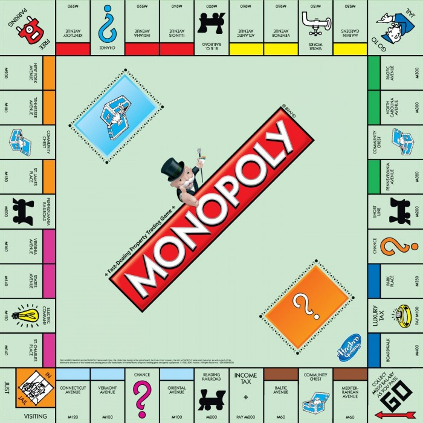

# Behaviour-Driven Development kata: Monopoly

[Monopoly rules](https://en.wikibooks.org/wiki/Monopoly/Official_Rules)



## Describe the glossary

## Describe the rules as BDD scenarios

* determine players turns
* player actions on its turn
  * roll the dice
  * move number of spaces according to the dice roll
  * buy unowned property where she lands
  * pay the rent for the owned property where she lands
  * pay the tax to the Bank when landing on a Tax space
  * pick a card when landing in Chance/Community Chest space, and follow instruction
  * go to Jail when landing on Go to Jail space
  * trade with other players
  * buy or improve buildings
  * mortgage one or more owned properties
* player actions not on its turn
  * trade with other players
  * bid for an auctioned property
* doubles roll
  * play once more for 1st and 2nd doubles
  * go to Jail for 3rd double
* GO pass rules
  * twice the amount if landing directly on it
* property buying
  * property auction
* property set ownership
* building construction
  * houses
  * hotels
* rent calculation
  * property
  * property in a set
  * property with buildings
  * railroad
  * utilities
* mortgage/unmortgage(10% interest)
* jailed
* bankruptcy


## Some examples

### GO pass

```gherkin
Scenario: Player Emma passes GO and gets rewarded
  Given player Emma owns 400M
  When player Emma passes GO
  Then player Emma should receive 200M
  And player Emma should own 600M
```

Are 100% fine with this example?
<details><summary> Spoiler alert</summary>
<p>

* Is this always true? What happens if the Bank has no more money? if the Bank does not have the right change?
* Is "passes GO" enough accurate?

</p>

</details>

### Property set

```gherkin
Scenario: Player Patrick buys a property set
  Given player Patrick owns 2 properties of the same colour
  When he buys a third property within the same colour
  Then the properties value should be increased
  And he can buy buildings
```

Find some description smells

<details><summary> Spoiler alert</summary>
<p>

* isn't it a rule disguised as an example?
  * what specific colour?
  * what properties are owned? which property is missing?
* shouldn't we recall player Patrick for each step?
* properties value is increased: how much? what was the initial value of the property set? what is the final value?
* player Patrick can buy buildings: it is a possibility, not a fact
   * => provide an example where the player owns a property set as a pre-requisite and he buys a building
</p>
</details>

### Double roll

```gherkin
Scenario: Player Morris rolls a double
   Given player Morris rolls a double
   When player Morris has performed is actions
   Then player Morris should roll again
```
Find some description smells

<details><summary> Spoiler alert</summary>
<p>

* to roll a double is not an accurate example; that should be: rolls 2 and 2 for instance
* example description is awkward: the When clause is not really an action but part of the context; the real action should be: When determining next player's turn
* the count of consecutive double rolls is not taken into account: it should be described in the context
</p>
</details>
